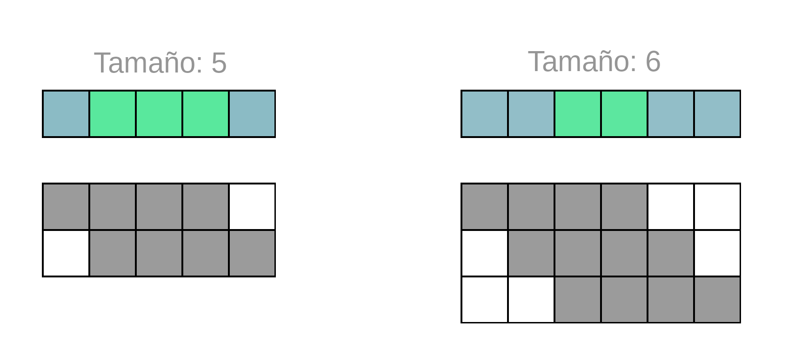

# Ejercicio Mutantes - Mercadolibre

Ejercicio práctico para MercadoLibre.

## Ejercicio

Magneto quiere reclutar la mayor cantidad de mutantes para poder luchar
contra los X-Mens.
Te ha contratado a ti para que desarrolles un proyecto que detecte si un
humano es mutante basándose en su secuencia de ADN.
Para eso te ha pedido crear un programa con un método o función con la siguiente firma:  

**boolean isMutant(String[] dna);**  

En donde recibirás como parámetro un array de Strings que representan cada fila de una tabla
de (NxN) con la secuencia del ADN. Las letras de los Strings solo pueden ser: (A,T,C,G), las
cuales representa cada base nitrogenada del ADN.

### Especificaciones

El archivo PDF con el enunciado recibido se encuentra en la carpeta `especificaciones`.

### Implementacion, tecnoligías y requisitos

- [Slim Framework](http://www.slimframework.com/)
- [MySQL](https://www.mysql.com/)
- [PHP7.2](https://www.php.net/)
- [PHPUnit](https://phpunit.de/)
- [XDebug](https://xdebug.org/)

#### Requisitos para instalar dependecias
 [Composer](https://getcomposer.org/) para dependecias

### Comentarios
Decidí realizar el desafío con las tecnologías con las que estoy más familiarizado y eso me llevó a la búsqueda de un framework rápido y liviano para desarrollar la API con PHP.
No había tenido la oportinidad de trabajar anteriormente con [Slim Framework](http://www.slimframework.com/) ni había realizado deploys en Google App Engine, por lo que me apoyé en la documentación de cada uno para realizar el proyecto.

### Algoritmo
Definí tres algoritmos: 1 de uso general y dos especiales para matrices con tamaño 5 y 6

- El algoritmo de uso general recorre la matriz en búsqueda de una secuencia de dos caracteres iguales, para luego comparar si la secuencia de dos caracteres siguientes también coincide

- El algoritmo de uso en casos especiales fue realizado e implementado posteriormente. Este se basa en la premisa que para matrices con tamaño menor o igual a 6 es condición necesaria para una fila o una columna que los elementos en las columas centrales coincidan. De esta manera se puede descartar una fila o columna no mutante con solo una comparación.
Si en cambio se encuentra coincidencia en los elementos centrales, se procede a comparar con los elementos anteriores y siguientes para determinar si el adn es mutante.

Nota: Ambos algoritmos utilizan el mismo método para las búsquedas en las diagonales

#### Gráfico


- Gris: Posibles ubicaciónes de la secuencia mutante en una fila
- Verde: Condición necesaria para que exista posibilidad de que sea mutante.
- Celeste: Ubicaciones a verificar en caso de encontrar coincidencia en columnas centrales

## Setup

### Instrucciones
Para ejecutar el proyecto es necesario contar PHP 7.2 y MySQL.

1. Clonar este repositorio.
2. Se debe crear una base de datos, en ella importar el al archivo "migration.sql" que se encuentra en el directorio /db.
3. En el archivo /config/db.php completar con sus datos de conexión a la base de datos:
```php
private $dbhost = 'su_host';
private $dbuser = 'su_usuario';
private $dbpass = 'su_password';
private $dbname = 'nombre_db';
```
4. Abra la terminal y colóquese sobre la carpeta raiz del proyecto
5. Instale las dependencias con ```$composer install```
6. Inicie el servicio mediante ```$php -S localhost:8888 -t public public/index.php```
7. Podrá verificar el funcionamento visitando [http://localhost:8888/](http://localhost:8888/)

### API Url

URL local: http://localhost:8888

URL hosteada en Google: https://mutantsml.appspot.com/

### Servicios
#### Analisis Mutante

Request:
- POST https://mutantsml.appspot.com/mutant/

Request body raw JSON (ADN mutante):

```
  {"dna":["ATGCGA", "CAGGGC", "TTATGT", "AGAAGG", "CCCCTA", "TCACTG"]}
```

Response:

```
  200 OK
```
Request body raw JSON (caso ADN humano):

```
  {"dna":["AATACT", "CCCAGA", "GGGATT", "AATTCC", "GGATCG", "TCACTG"]}
```

Response:

```
  403 Forbidden
```
Request body raw JSON (caso ADN no analizable):

```
  {"dna":["XXXXX", "CCCAGA", "GGGATT", "AATTCC", "GGATCG", "TCACTG"]}
```

Response:

```
  422 Unprocessable Entity
```

#### Estadisticas

Request:
- GET https://mutantsml.appspot.com/stats

Response: 200 (application/json)

```
{
    count_mutant_dna: x,
    count_human_dna: x,
    ratio: x.x
}
```

### Test

#### Cobertura

El análisis de cobertura se encuentra disponible en

`src/coverage`
